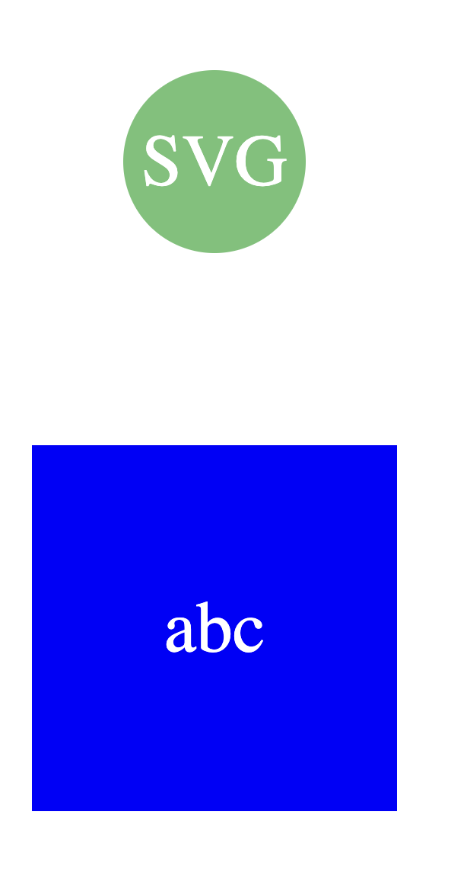

# SVG-Logo

## Description

I built this project so developers won't have to pay someone to create a logo for them. With this application you can generate your own SVG logos through the command line terminal. During this project I learned and worked more with jest and inquirer, and running test on your code, as well as learning more about SVG's.

## Table of Contents (Optional)

If your README is long, add a table of contents to make it easy for users to find what they need.

- [Installation](#installation)
- [Usage](#usage)
- [Credits](#credits)
- [License](#license)

## Installation

To use this application first install jest and inquirer 8.2.4, after run node index.js into the terminal

## Usage

To use this application you want to install jest and inquirer 8.2.4. After installing those pacakages you can run node index.js to invoke the application. Following the prompts that appear in the terminal command line and a "logo.svg" file should appear to left hand side in your explorer. You can then open the SVG in the browser.

Here is a walkthrough video using the application: 
https://drive.google.com/file/d/1vZhOXFkRercQ3eEtTyYlNavz2t23ZSs3/view

## Credits

- hexidecimal (https://icolorpalette.com/color/soft-green)
- https://www.npmjs.com/package/inquirer/v/8.2.4
- https://www.npmjs.com/package/jest

## License

Refer to documentation in Repo: https://mit-license.org/

## Features

creates SVG logo

## How to Contribute

The [Contributor Covenant](https://www.contributor-covenant.org/) is an industry standard

## Tests

you can test this by cloning the repo and running node index.js. You can also run "npm test" which will invoke my test, if all pass you are good to go!

